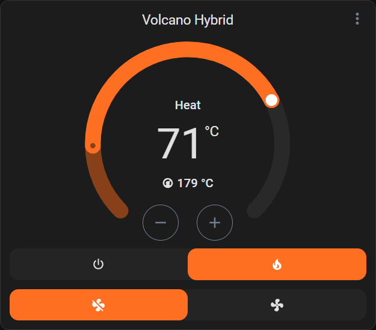
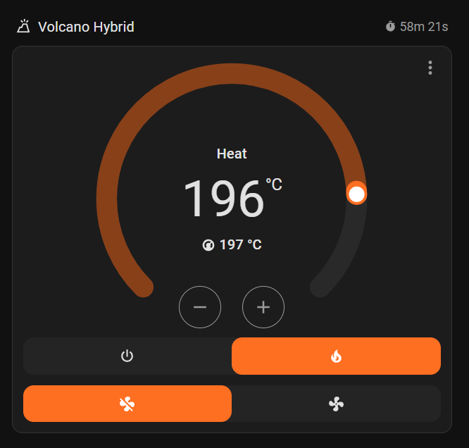
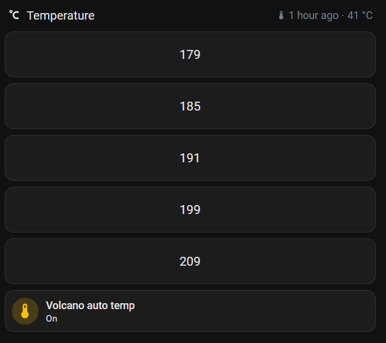

# Home Assistant Volcano Hybrid
[![hacs][hacs_badge]][hacs_url]
[![Validate][validate_badge]][validate_url]

[![gh_latest_release_badge]][gh_latest_release_url] 
![gh_release_date_badge]
[![gh_issues_badge]][gh_issues_url]

A Storz & Bickel Volcano Hybrid integration for Home Assistant using Bluetooth. Allows controlling core features via a single climate entity.



## Installing

Install using HACS, or download the repository and put the files from `custom-components` in your `config/custom_components` folder.

## Quick start

- Add the integration
- Power on your Volcano Hybrid
- If you have BLE adapters configured the device should be discovered automatically
- Add it when it's found and start using the `climate.volcano_hybrid` entity.


## Usage

This integration adds a `climate` entity to control the Volcano Hybrid:

It shows the following information and allows these controls:
- Current temperature (read-only)
- Target temperature
- Set directly or increase value in 1 degree steps
- Enable/disable heating
- Enable/disable fan

Additionally, there are the following configuration/diagnostic entities:
- The auto off time setting (configurable)
- Led brightness (configurable)
- Whether the device is showing temperature in Celsius or Fahrenheit (configurable)
- Whether vibration is enabled (configurable)
- The total heating time
- Whether the auto off timer is enabled (this is essentially the same as the heating state)
- The device connected state
- A reconnect button
- The rssi from the last ble message

## Warning

### Do not leave the device unattended while using the integration

That being said, there are some safety measures:
- Temperature commands **WILL** be retried every second (while the device is on) when they don't appear to get set
- On-commands (fan-on, heater-on) **WON'T** be retried. If they fail, they fail.
- Off-commands **WILL** be retried (as long as the device is on, but if they fail, it will be on)

This will however not protect you from losing control when bluetooth fails, so _do not leave the device unattended while using the integration_.

## Notice

This integration will connect to the Volcano as soon as it finds one (after it has been setup). 
This means that updates from the device will trigger updates in Home Assistant instantly, but also that no other bluetooth devices will be able to control the Volcano.

I might make that configurable at some point (if anyone wants it and asks for it, possibly).

# Example usage

- [Dashboard grid with shut-off timer and current states](#Dashboard-grid-with-shut-off-timer-and-current-states)
- [Dashboard button card for pre-selected temperatures](#Button-card-for-pre-selected-temperatures)
- [Automation to automatically progress temperature over time](#Automatically-progress-temperature-over-time)
- [Example service calls to increase/decrease temperature by Vapesuvius temp guide steps](#increasedecrease-temperature-by-vapesuvius-temp-guide-steps)
- [Script to fill a bag](#fill-a-bag)


## Dashboard grid with shut-off timer and current states

An example grid with a header and a thermostat entity (both standard Home Assistant components).



```yaml
type: grid
cards:
  - type: heading
    heading: Volcano Hybrid
    heading_style: title
    icon: mdi:volcano-outline
    badges:
      - type: entity
        show_state: true
        show_icon: true
        entity: sensor.volcano_hybrid_auto_off_time
  - type: thermostat
    entity: climate.volcano_hybrid
    features:
      - style: icons
        type: climate-hvac-modes
      - style: icons
        type: climate-fan-modes
    show_current_as_primary: true
    name: " "
```

## Button card for pre-selected temperatures



Example grid using [Button Card](https://github.com/custom-cards/button-card) to easily set pre-defined temperatures.

```yaml
type: grid
cards:
  - type: heading
    heading: Temperature
    heading_style: title
    icon: mdi:temperature-celsius
  - type: custom:button-card
    name: 179
    tap_action:
      action: call-service
      service: climate.set_temperature
      data:
        hvac_mode: heat
        temperature: 179
      target:
        entity_id: climate.volcano_hybrid
  - type: custom:button-card
    name: 185
    tap_action:
      action: call-service
      service: climate.set_temperature
      data:
        hvac_mode: heat
        temperature: 185
      target:
        entity_id: climate.volcano_hybrid
  - type: custom:button-card
    name: 191
    tap_action:
      action: call-service
      service: climate.set_temperature
      data:
        hvac_mode: heat
        temperature: 191
      target:
        entity_id: climate.volcano_hybrid
  - type: custom:button-card
    name: 199
    tap_action:
      action: call-service
      service: climate.set_temperature
      data:
        hvac_mode: heat
        temperature: 199
      target:
        entity_id: climate.volcano_hybrid
  - type: custom:button-card
    name: 209
    tap_action:
      action: call-service
      service: climate.set_temperature
      data:
        hvac_mode: heat
        temperature: 209
      target:
        entity_id: climate.volcano_hybrid
  - type: tile
    entity: automation.volcano_progress
    features_position: bottom
    vertical: false
    name: Volcano auto temp
    grid_options:
      columns: full
    tap_action:
      action: toggle
```

## Automatically progress temperature over time

This is an example automation that will automatically increase the temperature in 5-minute intervals.
Follows the [Vapesuvius temp guide](https://www.reddit.com/user/Vapesuvius/comments/zuwcs7/vapesuvius_unofficial_storz_bickel_temp_guide_2nd/) (for temp, not time)

```yaml
alias: Volcano progress
description: ""
triggers:
  - trigger: numeric_state
    entity_id:
      - sensor.volcano_hybrid_current_on_time
    above: 0
    id: "179"
    alias: 0 => 179
  - trigger: numeric_state
    entity_id:
      - sensor.volcano_hybrid_current_on_time
    above: 5
    id: "185"
    alias: 5 => 185
  - trigger: numeric_state
    entity_id:
      - sensor.volcano_hybrid_current_on_time
    above: 10
    id: "191"
    alias: 10 => 191
  - trigger: numeric_state
    entity_id:
      - sensor.volcano_hybrid_current_on_time
    above: 15
    id: "199"
    alias: 15 => 199
  - trigger: numeric_state
    entity_id:
      - sensor.volcano_hybrid_current_on_time
    above: 20
    id: "205"
    alias: 20 => 205
conditions:
  - alias: Don't trigger when device reconnects
    condition: and
    conditions:
      - condition: template
        value_template: "{{ trigger.from_state.state not in ['unknown','unavailable'] }}"
        alias: from_state was unknown or unavailable
actions:
  - action: climate.set_temperature
    metadata: {}
    data:
      temperature: "{{ trigger.id  }}"
    target:
      entity_id: climate.volcano_hybrid
mode: single
```

### Increase/decrease temperature by Vapesuvius' temp guide steps

I use these, combined with a dimmer switch.

- Long press on: Turn on heating
- Long press off: Turn off heating
- Short press on: Turn on fan
- Short press off: Turn off fan
- Up: Increase temperature using these actions
- Down: Decrease temperature using these actions

```yaml
  - action: climate.set_temperature
    metadata: {}
    data:
      temperature: >
        
        179185191199205
    target:
      entity_id:
        - climate.volcano_hybrid
    alias: Inc temp


  - action: climate.set_temperature
    metadata: {}
    data:
      temperature: >
        
        205199191185179
    target:
      entity_id:
        - climate.volcano_hybrid
    alias: Dec temp
```

### Fill a bag

This is an example script that will:
1. Turn on the Volcano
1. Wait for the device to heat up, and then 10s more
1. Turn on the fan
1. Wait for 40s (that's how long it takes to nearly fill up my standard bags, adjust to yours accordingly)
1. Turns off the fan
1. Waits 10 more seconds (this gives you time to turn the fan on to fill the bag completely)
1. Turns off the Volcano

```yaml
sequence:
  - action: climate.turn_on
    metadata: {}
    data: {}
    target:
      entity_id: climate.volcano_hybrid
  - wait_template: >-
      {{state_attr('climate.volcano_hybrid', 'temperature') ==
      state_attr('climate.volcano_hybrid', 'current_temperature')}}
    continue_on_timeout: true
    alias: Wait for heatup
  - alias: Wait a little bit more
    delay:
      hours: 0
      minutes: 0
      seconds: 10
      milliseconds: 0
  - action: climate.set_fan_mode
    metadata: {}
    data:
      fan_mode: "on"
    target:
      entity_id: climate.volcano_hybrid
  - alias: Wait for the bag to fill (40s)
    delay:
      hours: 0
      minutes: 0
      seconds: 41
      milliseconds: 0
  - action: climate.set_fan_mode
    metadata: {}
    data:
      fan_mode: "off"
    target:
      entity_id: climate.volcano_hybrid
  - delay:
      hours: 0
      minutes: 0
      seconds: 10
      milliseconds: 0
    alias: Wait a little bit more
  - action: climate.turn_off
    metadata: {}
    data: {}
    target:
      entity_id: climate.volcano_hybrid
alias: Volcano fill bag
description: ""
```


[validate_url]: https://github.com/SavageNL/home-assistant-volcano-hybrid/actions/workflows/validate.yml
[validate_badge]: https://github.com/SavageNL/home-assistant-volcano-hybrid/actions/workflows/validate.yml/badge.svg
[hacs_url]: https://github.com/hacs/integration
[hacs_badge]: https://img.shields.io/badge/HACS-Default-orange.svg
[gh_latest_release_badge]: https://img.shields.io/github/v/release/SavageNL/home-assistant-volcano-hybrid
[gh_latest_release_url]: https://github.com/SavageNL/home-assistant-volcano-hybrid/releases
[gh_release_date_badge]: https://img.shields.io/github/release-date/SavageNL/home-assistant-volcano-hybrid
[gh_issues_badge]: https://img.shields.io/github/issues/SavageNL/home-assistant-volcano-hybrid
[gh_issues_url]: https://github.com/SavageNL/home-assistant-volcano-hybrid/issues
